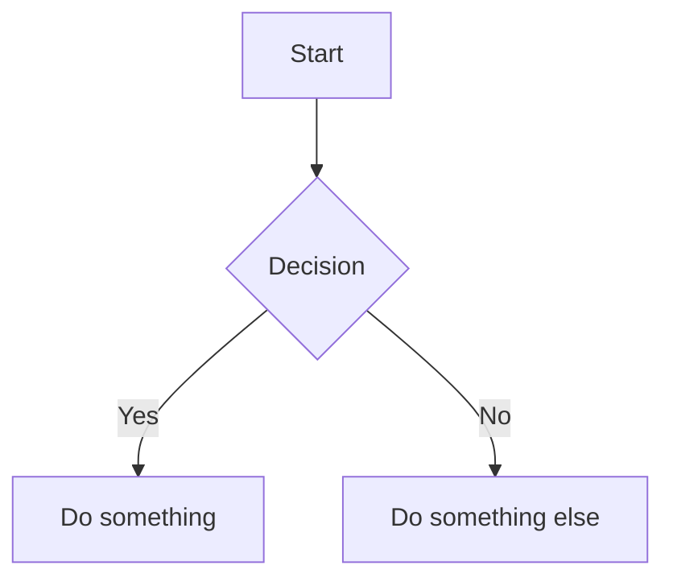

# markservant (msv)

CLI tool to manage multiple [markserv](https://github.com/markserv/markserv) instances with auto-start persistence.

## Features

- **Kokoro TTS** - Read markdown aloud with word-by-word highlighting in VS Code
- **Mermaid diagrams** - Flowcharts, sequence diagrams, class diagrams, and more
- Watch multiple directories with markserv
- Auto-assign ports (no conflicts)
- Auto-start on login (macOS LaunchAgent)
- Open in Microsoft Edge with one command

## Install

```bash
# Install markservant
npm install -g markservant

# Install markserv with Mermaid support (recommended)
npm install -g github:galer7/markserv
```

## Usage

```bash
# Add current directory to watch list
msv add

# Add specific directory
msv add ~/p/my-project

# Add with dotfiles visible in listings
msv add --dotfiles ~/p/my-dotfiles

# List all servers
msv list

# Open a server in Edge
msv open

# Remove from watch list
msv rm

# Stop all servers (keeps config)
msv stop

# Start all servers
msv start
```

## Options

### `msv add [directory]`

| Option | Description |
|--------|-------------|
| `--dotfiles` | Show hidden files (dotfiles) in directory listings |

## Mermaid Diagrams

With the [forked markserv](https://github.com/galer7/markserv), your markdown files can include Mermaid diagrams:

````markdown

````

Supports flowcharts, sequence diagrams, class diagrams, state diagrams, ER diagrams, Gantt charts, and more. See the [Mermaid documentation](https://mermaid.js.org/) for all diagram types.

## Kokoro TTS (Read Aloud in VS Code)

Read markdown files aloud with word-by-word highlighting using [Kokoro TTS](https://github.com/remsky/Kokoro-FastAPI) (82M param open-source model, runs locally via Docker).

### Prerequisites

- Docker running on your machine
- VS Code
- pnpm (`npm install -g pnpm`)

### Setup

```bash
# 1. Install dependencies
pnpm install

# 2. Start the Kokoro TTS server (pulls ~3GB Docker image on first run)
node packages/cli/bin/msv.js tts-server start

# 3. Build and install the VS Code extension
pnpm --filter markservant-tts build
cd packages/vscode-extension && npx @vscode/vsce package --no-dependencies
code --install-extension "$(pwd)/markservant-tts-0.1.0.vsix"
```

Reload VS Code after installing the extension.

### Usage

1. Open any `.md` file in VS Code
2. Press `Cmd+Shift+R` (or run command **MarkServant TTS: Read Aloud**)
3. Audio plays with word-by-word highlighting in the editor
4. Run **MarkServant TTS: Stop** to stop playback

### VS Code Settings

| Setting | Default | Description |
|---------|---------|-------------|
| `markservant-tts.serverUrl` | `http://localhost:8880` | Kokoro server URL |
| `markservant-tts.voice` | `af_heart` | TTS voice |
| `markservant-tts.speed` | `1.0` | Playback speed (0.5–2.0) |

### TTS Server Management

```bash
node packages/cli/bin/msv.js tts-server start    # Start Kokoro container
node packages/cli/bin/msv.js tts-server status   # Check if running
node packages/cli/bin/msv.js tts-server stop     # Stop and remove container
```

### Testing

```bash
# Run all tests (359 total)
pnpm test

# CLI tests only (259 tests)
pnpm --filter markservant test

# VS Code extension tests only (100 tests)
pnpm --filter markservant-tts test
```

#### Manual E2E Testing

| Test | Steps | Expected |
|------|-------|----------|
| Short file | Open 1-paragraph `.md`, press `Cmd+Shift+R` | Audio plays, words highlight as spoken |
| Formatting | File with headings, bold, links, code blocks | Code blocks skipped, highlights on correct words |
| Long file | 3000+ word doc, `Cmd+Shift+R` | Seamless chunked playback |
| Stop | Stop mid-playback | Audio stops, highlights clear immediately |
| Edit during playback | Edit document while playing | Playback stops automatically |
| Re-invoke | Press `Cmd+Shift+R` while playing | Restarts from beginning |

## Requirements

- Node.js >=18
- macOS
- Docker (for Kokoro TTS)
- markserv with Mermaid support (`npm install -g github:galer7/markserv`)

## License

MIT
