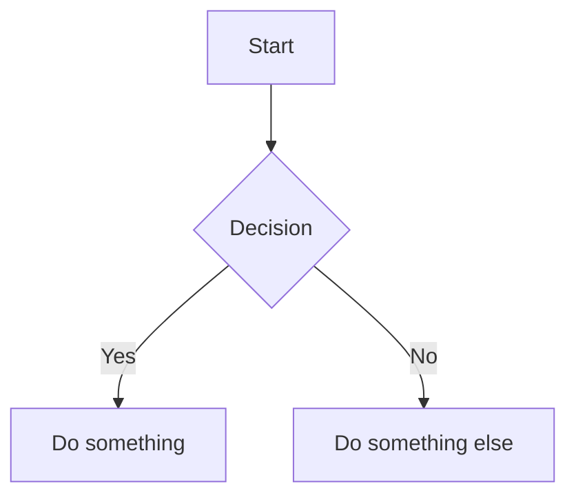

# markservant (msv)

CLI tool to manage multiple [markserv](https://github.com/markserv/markserv) instances with auto-start persistence.

## Features

- **Mermaid diagrams** - Flowcharts, sequence diagrams, class diagrams, and more
- Watch multiple directories with markserv
- Auto-assign ports (no conflicts)
- Auto-start on login (macOS LaunchAgent)
- Open in Microsoft Edge with one command

## Install

```bash
# Install markservant
npm install -g markservant

# Install markserv with Mermaid support (recommended)
npm install -g github:galer7/markserv
```

## Usage

```bash
# Add current directory to watch list
msv add

# Add specific directory
msv add ~/p/my-project

# Add with dotfiles visible in listings
msv add --dotfiles ~/p/my-dotfiles

# List all servers
msv list

# Open a server in Edge
msv open

# Remove from watch list
msv rm

# Stop all servers (keeps config)
msv stop

# Start all servers
msv start
```

## Options

### `msv add [directory]`

| Option | Description |
|--------|-------------|
| `--dotfiles` | Show hidden files (dotfiles) in directory listings |

## Mermaid Diagrams

With the [forked markserv](https://github.com/galer7/markserv), your markdown files can include Mermaid diagrams:

````markdown

````

Supports flowcharts, sequence diagrams, class diagrams, state diagrams, ER diagrams, Gantt charts, and more. See the [Mermaid documentation](https://mermaid.js.org/) for all diagram types.

## Requirements

- Node.js
- macOS
- markserv with Mermaid support (`npm install -g github:galer7/markserv`)

## License

MIT
