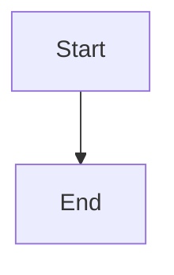

# Mermaid Diagram Support Specification

## Overview

Add Mermaid diagram rendering to markservant so that markdown files with mermaid code blocks display as actual diagrams instead of raw code.

## Problem Statement

Currently, when a markdown file contains a Mermaid code block:

````markdown

````

It renders as a code block with syntax highlighting, not as a visual diagram.

## Architecture Context

```
┌─────────────────┐     spawns      ┌─────────────┐
│  markservant    │ ───────────────▶│  markserv   │
│  (process mgr)  │                 │  (renderer) │
└─────────────────┘                 └─────────────┘
                                           │
                                           ▼
                                    ┌─────────────┐
                                    │ markdown-it │
                                    │  + plugins  │
                                    └─────────────┘
```

**Key insight**: Markdown rendering happens inside `markserv`, not `markservant`.

## Solution: Client-Side Mermaid Rendering

Inject Mermaid.js into markserv's HTML output so the browser renders diagrams client-side.

### Why Client-Side?

1. **Minimal changes** - Only requires adding 2 lines to HTML template
2. **Battle-tested** - This is how GitHub, GitLab, and other platforms render Mermaid
3. **No server dependencies** - No need to install Puppeteer, Chrome, etc.
4. **Always up-to-date** - CDN serves latest Mermaid version

## Functional Requirements

### FR-1: Mermaid Code Blocks Render as Diagrams
- Code blocks with language `mermaid` render as SVG diagrams
- Supported diagram types: flowchart, sequence, class, state, ER, gantt, pie, etc.

### FR-2: Syntax Errors Display Gracefully
- Invalid Mermaid syntax shows an error message, not a broken page

### FR-3: No Impact on Non-Mermaid Content
- Regular markdown rendering is unaffected
- Other code blocks (js, python, etc.) render normally with syntax highlighting

## Non-Functional Requirements

### NFR-1: Performance
- Mermaid.js loads from CDN (jsDelivr) for fast delivery
- Diagrams render client-side without server overhead

### NFR-2: Offline Support (Optional)
- Could bundle Mermaid.js locally for offline use (future enhancement)

## Technical Approach

### Option A: Fork markserv (Recommended)

1. Fork `markserv` to `markserv-mermaid` or patch locally
2. Modify `lib/templates/markdown.html` to add:
   ```html
   <script src="https://cdn.jsdelivr.net/npm/mermaid/dist/mermaid.min.js"></script>
   <script>mermaid.initialize({ startOnLoad: true });</script>
   ```
3. Publish fork or use local install

### Option B: Post-process HTML (Alternative)

1. Create a middleware/proxy in markservant
2. Intercept markserv's HTML responses
3. Inject Mermaid script before `</body>`

**Not recommended**: Adds complexity, latency, and maintenance burden.

## Acceptance Criteria

- [ ] Mermaid flowcharts render correctly
- [ ] Mermaid sequence diagrams render correctly
- [ ] Mermaid class diagrams render correctly
- [ ] Invalid Mermaid syntax shows error, doesn't break page
- [ ] Regular code blocks still have syntax highlighting
- [ ] Live reload still works when markdown files change

## Out of Scope

- Server-side rendering (would require Puppeteer/Chrome)
- Custom Mermaid themes (use defaults)
- Mermaid configuration options (use sensible defaults)
