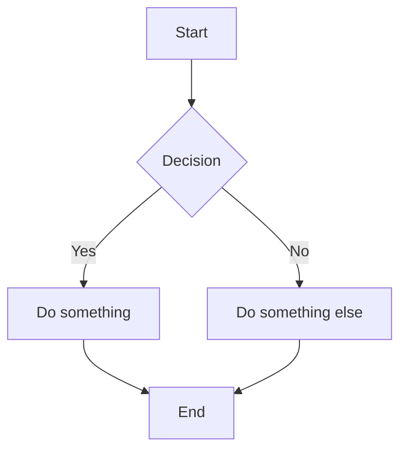
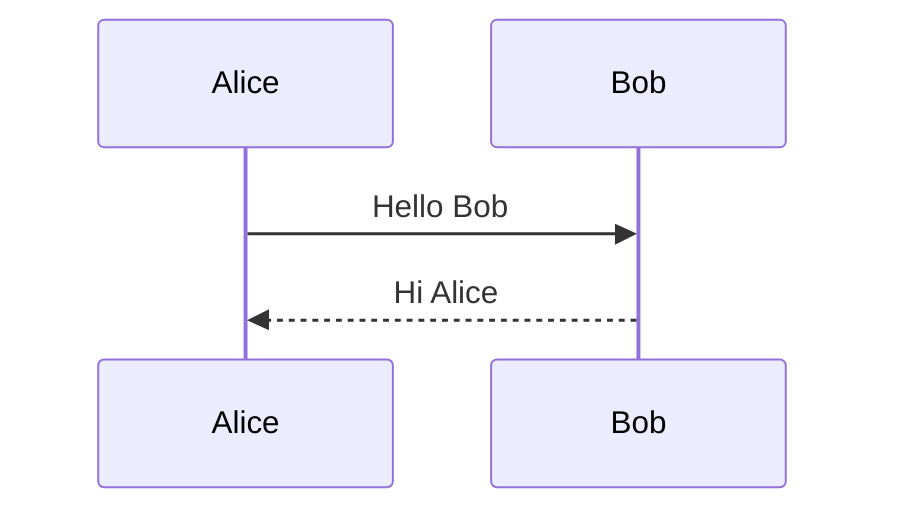
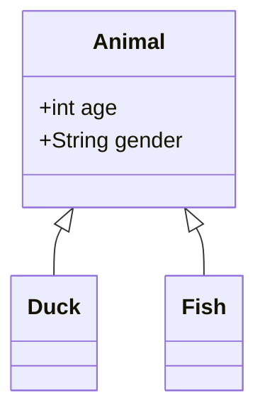

# Mermaid Test Document

This file tests Mermaid diagram rendering.

## Flowchart



## Sequence Diagram



## Class Diagram



## Regular Code Block (should still highlight)

```javascript
function greet(name) {
  console.log(`Hello, ${name}!`);
}
```

## Invalid Mermaid (should show error)

```mermaid
this is invalid syntax
```
